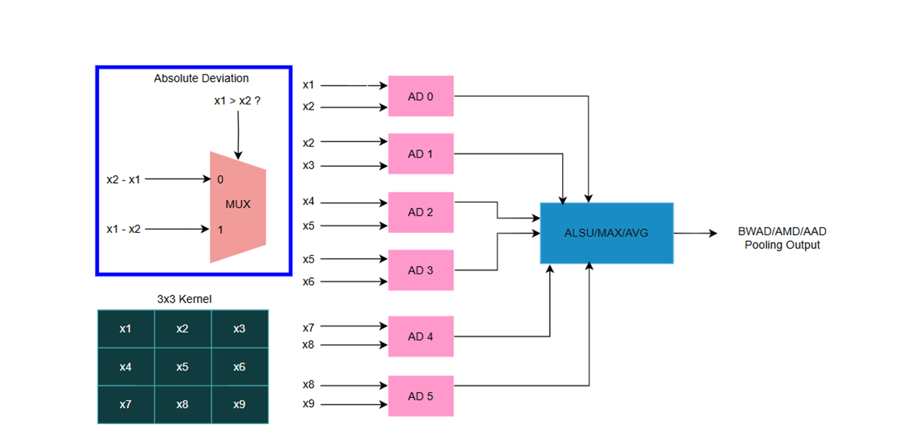
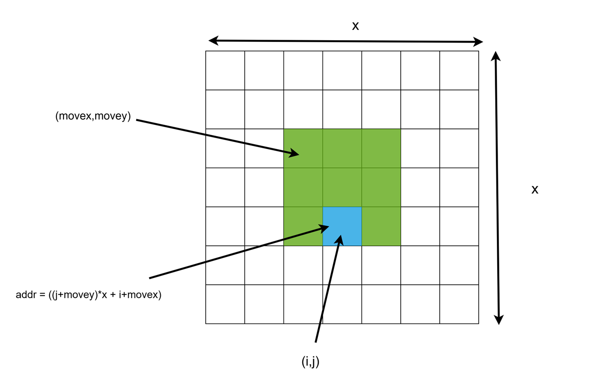
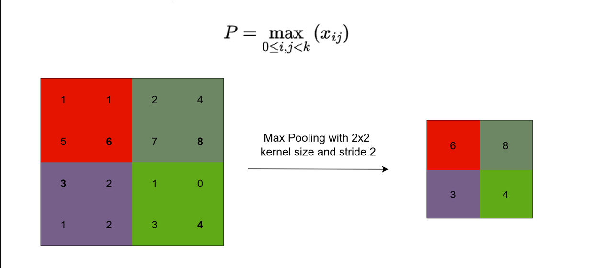
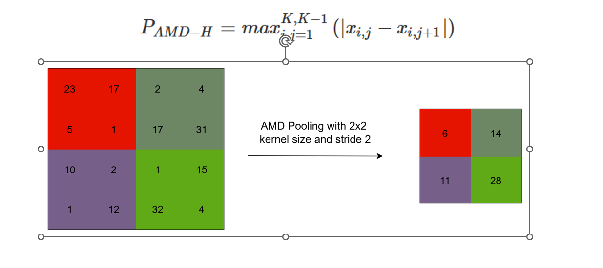
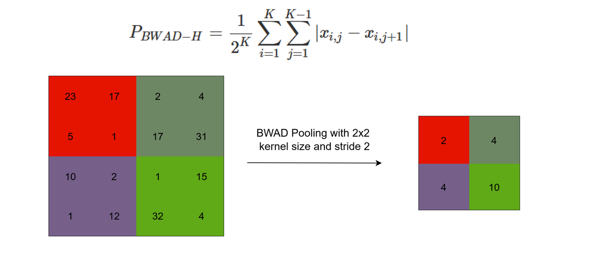
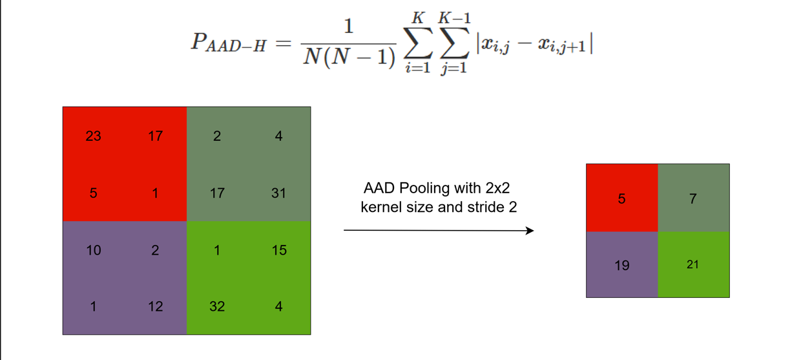
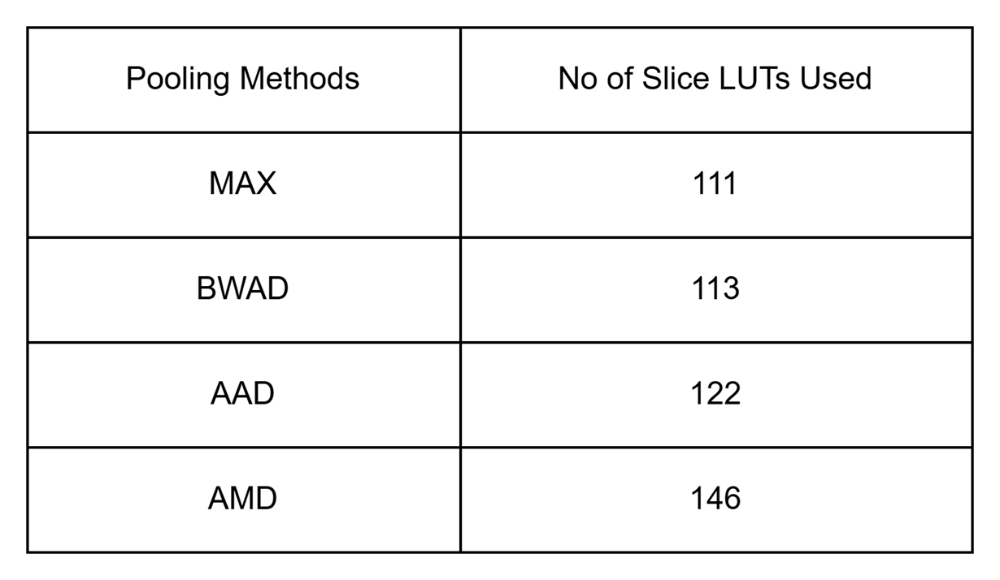
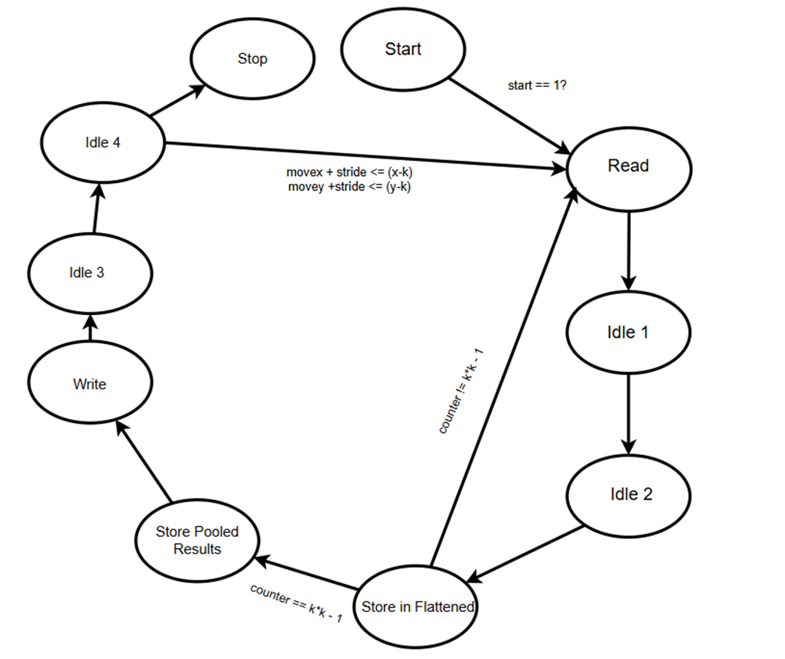
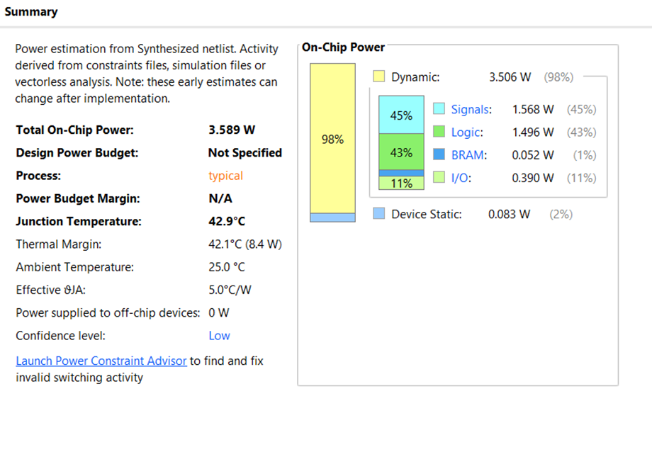

# Hardware Pooling Designs for CNNs on FPGA 
## **ES 204: Digital Systems Project**

## Team Members

### Arjun Anand Mallya

- Roll No: 23110039
- Github ID: ArjunAnandMallya

### Vivek Raj

- Roll No: 23110362
- Github ID: VivekRaj2005

## Links

- **Github Repo Link**: <a href="https://github.com/ArjunAnandMallya/Digital-Systems-Project">https://github.com/ArjunAnandMallya/Digital-Systems-Project</a>

- **Video Link**: <a href="https://iitgnacin-my.sharepoint.com/:v:/g/personal/23110362_iitgn_ac_in/EUyYeVOFENZLgfJCnyZZixEBjRhKEr3Et0tte__TPPp3IQ?nav=eyJyZWZlcnJhbEluZm8iOnsicmVmZXJyYWxBcHAiOiJPbmVEcml2ZUZvckJ1c2luZXNzIiwicmVmZXJyYWxBcHBQbGF0Zm9ybSI6IldlYiIsInJlZmVycmFsTW9kZSI6InZpZXciLCJyZWZlcnJhbFZpZXciOiJNeUZpbGVzTGlua0NvcHkifX0&e=Bh1bHk ">Video Link</a>

## Final Hardware Pipeline

## Hardware Implemetation

# Pooling

## Visualisation of Pooling

## MAX Pooling

## Absolute Maximum Deviation Pooling

## Binary Weighted Absolute Deviation

## Absolute Average Deviation

## Utilisation Metrics

# BRAM Contol Flow

# UART Control Flow

# Power Utilisation

